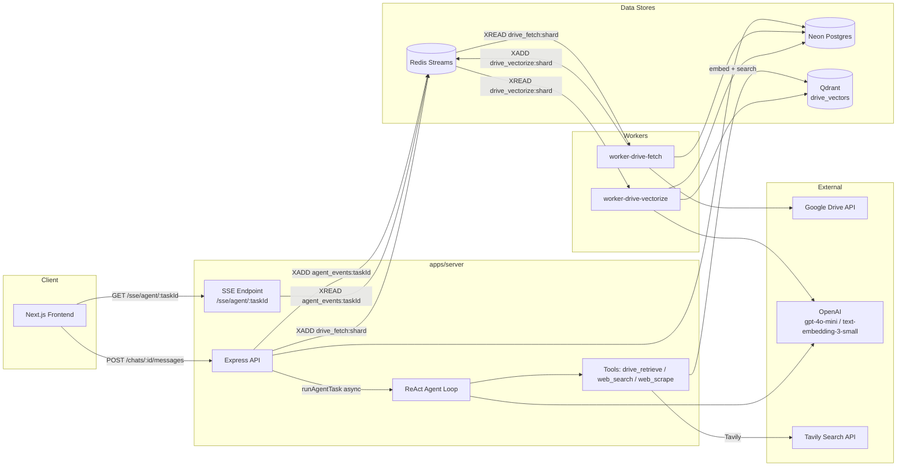
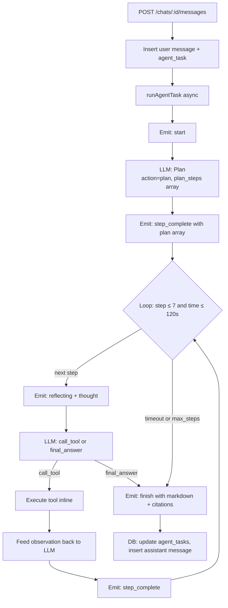
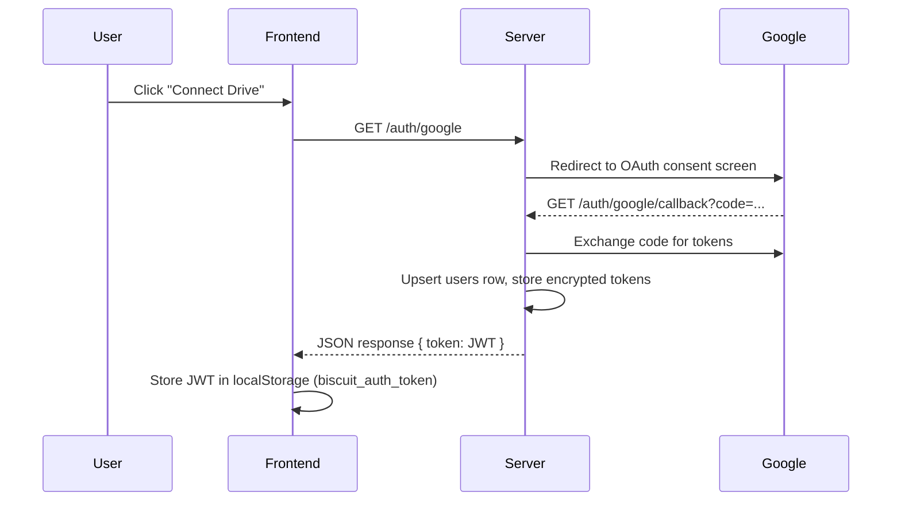
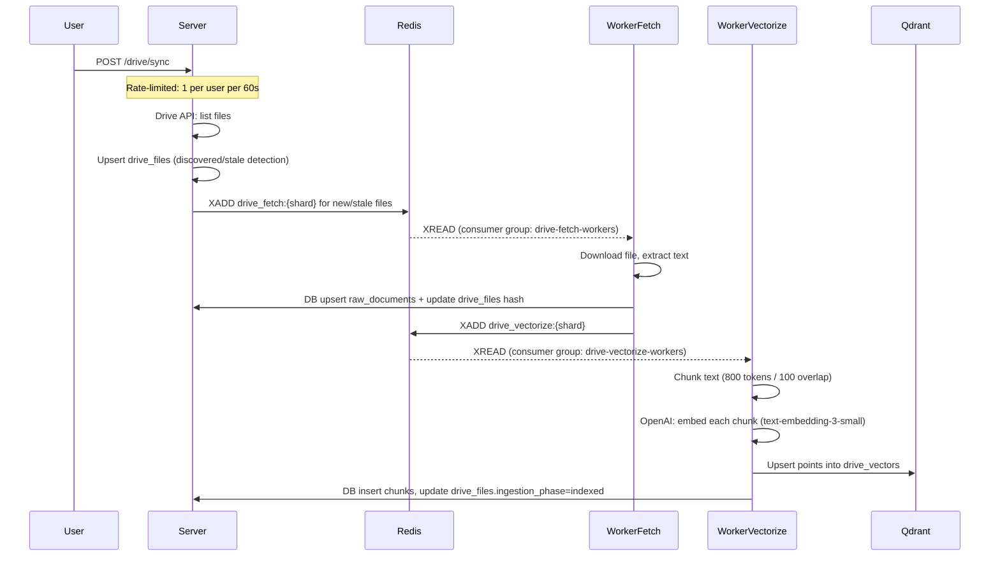
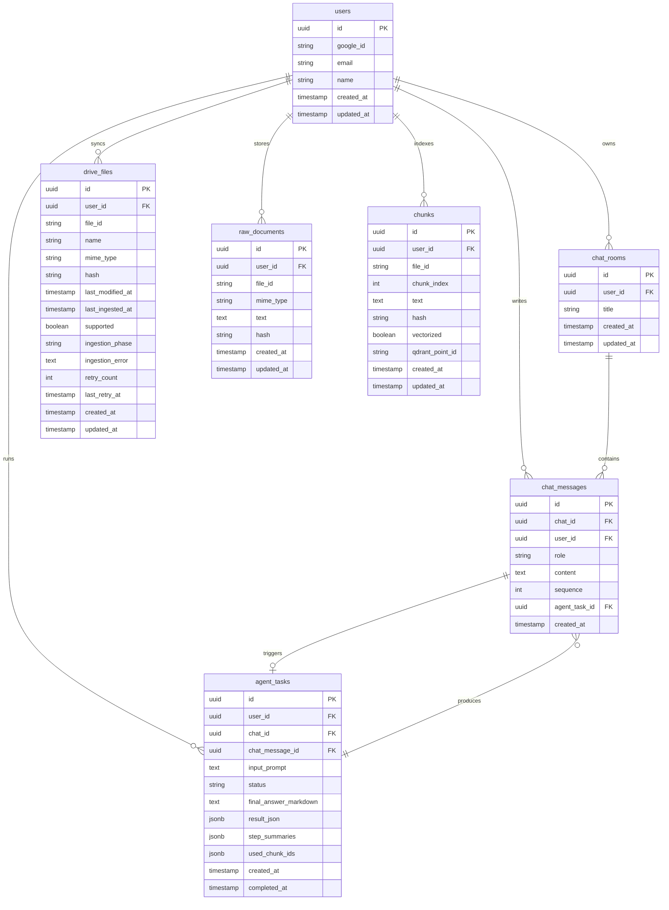

# Biscuit

**Biscuit** is a chat-based AI backend that enables users to converse with a ReAct-style agent that understands their Google Drive. Users can connect their Drive, index their documents, and query them via Retrieval-Augmented Generation. The agent handles planning, tool selection, observation, and final answer generation in a streaming loop backed by Redis Streams and securely served over SSE.

Built by [Harshit](https://www.hrsht.me).

Project live at [Biscuit](https://biscuit.hrsht.me)

## 🎥 Demo Videos

<a href="https://youtu.be/TjfJBwqrWIc" target="_blank">
  
</a>  
<p><b>Login Flow with Drive Sync</b> <a href="https://youtu.be/TjfJBwqrWIc" target="_blank">Video ^^^</a></p>

<a href="https://youtu.be/LYEhh0ZQyf0" target="_blank">
  
</a>  
<p><b>Drive Search Retrieval</b> <a href="https://youtu.be/LYEhh0ZQyf0" target="_blank">Video ^^^</a></p>

<a href="https://youtu.be/4GTol962uBc" target="_blank">
  
</a>  
<p><b>Web Search and Scrape Retrieval</b> <a href="https://youtu.be/4GTol962uBc" target="_blank">Video ^^^</a></p>


---

## Table of Contents

1. [High-Level Architecture](#high-level-architecture)
2. [Tech Stack](#tech-stack)
3. [Project Structure](#project-structure)
4. [Agent Architecture (Deep Dive)](#agent-architecture-deep-dive)
5. [Tools](#tools)
6. [Google Drive Integration](#google-drive-integration)
7. [Vector Database & Embeddings](#vector-database--embeddings)
8. [Real-Time Streaming (SSE)](#real-time-streaming-sse)
9. [Background Job System](#background-job-system)
10. [Rate Limiting](#rate-limiting)
11. [Caching](#caching)
12. [Authentication](#authentication)
13. [Database Schema](#database-schema)
14. [API Reference](#api-reference)
15. [Frontend Architecture](#frontend-architecture)
16. [Getting Started](#getting-started)
17. [Environment Variables](#environment-variables)
18. [Available Scripts](#available-scripts)

---

## High-Level Architecture

Here is an overview of how the different components of the system communicate with one another:



### End-to-End Data Flows

**Chat message → streamed answer:**
```
User input
  → POST /chats/:chatId/messages
  → DB: insert chat_messages (role=user) + agent_tasks (status=pending)
  → runAgentTask() [async, not awaited]
  → ReAct loop: Plan → Execute tools → Observe → Finalize
      → XADD agent_events:{taskId}  (per event)
  → GET /sse/agent/:taskId
      → XREAD agent_events:{taskId}
      → SSE push to browser
  → Frontend renders plan checklist + thought log + final answer + citations
```

**Drive sync → indexed chunks:**
```
POST /drive/sync  [rate-limited: 1 per user per 60s]
  → Google Drive API: list files
  → DB: upsert drive_files
  → XADD drive_fetch:{shard}
  → worker-drive-fetch:
      → Download file → extract text
      → DB: upsert raw_documents
      → XADD drive_vectorize:{shard}
  → worker-drive-vectorize:
      → Chunk text (800 tokens / 100 overlap)
      → OpenAI: embed each chunk (text-embedding-3-small)
      → Qdrant: upsert points into drive_vectors
      → DB: insert chunks, update drive_files.ingestion_phase=indexed
  → drive_retrieve tool: embed query → Qdrant search → return citations + snippets
```

---

## Tech Stack

Biscuit relies on the following tools and frameworks:

| Technology | Role |
|---|---|
| **Next.js 15 (App Router)** | Frontend — SSR, chat UI, Drive management |
| **Express.js** | API server (`apps/server`) |
| **Turborepo + pnpm** | Monorepo build orchestration |
| **Neon (serverless Postgres)** | Primary database via Drizzle ORM |
| **Drizzle ORM** | Type-safe SQL queries and migrations |
| **Redis** | Stream-based event bus, job queues, rate limiting |
| **Qdrant Cloud** | Vector similarity search (`drive_vectors` collection) |
| **OpenAI gpt-4o-mini** | Agent reasoning, planning, final answer generation |
| **OpenAI text-embedding-3-small** | Chunk + query embeddings (1536 dimensions) |
| **Tavily** | Web search in agent tool loop |
| **Google Drive API + OAuth2** | User Drive access and file ingestion |
| **KEDA** | Autoscaling workers based on Redis stream lag |
| **k3s** | Lightweight Kubernetes for deployment |
| **GitHub Actions** | CI/CD: build → push Docker images → deploy via kubectl |

---

## Project Structure

```
biscuit/
├── apps/
│   ├── server/                    # Express API + ReAct agent
│   │   └── src/
│   │       ├── agent/             # runAgentTask.ts, loop.ts (ReAct loop)
│   │       ├── tools/             # driveRetrieve.ts, web_search.ts, web_scrape.ts
│   │       ├── drive/             # Google Drive API client + route handlers
│   │       ├── auth/              # Google OAuth handlers
│   │       ├── chat/              # Chat room and message logic
│   │       ├── llm/               # openai.ts (callPlannerLLM, getEmbedding)
│   │       └── routes/            # Express router bindings
│   ├── web/                       # Next.js 15 frontend
│   │   └── src/
│   │       ├── app/chat/[id]/     # Chat room page (SSE consumer, AgentThoughtLoader)
│   │       ├── components/chat/   # MessageList, AgentThoughtLoader, CitationModal
│   │       └── components/drive/  # DriveSyncModal, IndexedDocsModal
│   ├── worker-drive-fetch/        # Fetch & text-extract worker
│   └── worker-drive-vectorize/    # Chunk, embed, upsert Qdrant worker
│
├── packages/
│   ├── db/                        # Drizzle schema, migrations, typed db client
│   ├── redis/                     # XADD/XREAD helpers, consumer group helpers
│   ├── qdrant/                    # ensureDriveVectorsCollection, searchDriveVectors
│   └── zod-schemas/               # All shared Zod schemas and inferred types
│
├── k8s/                           # Kubernetes manifests (redis, server, workers, KEDA)
└── .github/workflows/deploy.yml   # CI/CD pipeline
```

---

## Agent Architecture (Deep Dive)

The agent implements a **ReAct loop** in `apps/server/src/agent/loop.ts`, orchestrated by `runAgentTask.ts`. It runs entirely in-process on `apps/server`.

### Loop Overview



### Planning

The initial LLM call returns `action: "plan"` along with a `plan_steps` string array. The agent emits a `plan` event so the frontend can render the complete plan checklist prior to execution.

### Execution Loop

During each iteration:
1. Emits `reflecting` with `thought_for_next_step`.
2. Calls the LLM to determine the next move, expecting `action: "call_tool"` with `tool` and `tool_query`.
3. Executes the corresponding tool inline.
4. Appends the `Tool {toolName} Execution Result:\n{observation}` into its trajectory.
5. Emits `step_complete` with `observationSummary`.

### JSON Output Contract

The LLM is configured to output strict JSON based on three valid shapes. No markdown formatting or extra text output is expected.

```jsonc
// OPTION 1: plan (step 1 only)
{ "action": "plan", "plan_steps": ["...", "..."], "thought_for_next_step": "..." }

// OPTION 2: tool call
{ "action": "call_tool", "tool": "drive_retrieve|web_search|web_scrape", "tool_query": "...", "thought_for_next_step": "..." }

// OPTION 3: finish
{ "action": "final_answer", "final_answer_markdown": "...", "thought": "..." }
```

In the event of invalid output, the agent is re-prompted to correct the JSON before advancing to the next step.

### Constraints

The system uses the following configuration parameters:

| Constraint | Value |
|---|---|
| Max steps | 7 |
| Max wall-clock time | 120 seconds |
| `runAgentTask` | Async, not awaited by HTTP handler |
| In-process concurrency cap | `MAX_CONCURRENT_TASKS` (configurable, default 10) |
| Over-limit behavior | Fail-fast — new task requests beyond the limit are rejected |

---

## Tools

Tools are implemented directly within `apps/server/src/tools/`.

### `drive_retrieve`

| Field | Detail |
|---|---|
| **File** | `src/tools/driveRetrieve.ts` |
| **Input schema** | `DriveRetrieveInputSchema`: `{ query: string, userId: string, topK?: number }` |
| **Steps** | Embed query → search Qdrant `drive_vectors` filtered by `user_id` → fetch `chunks` rows from Postgres → group by `file_id` (top 2 chunks/file) → cap at 5 files |
| **Output** | `{ formattedSnippet: string, citations: DriveCitation[] }` |
| **Score cutoff** | Filters out hits below 0.2 cosine similarity |

### `web_search`

| Field | Detail |
|---|---|
| **File** | `src/tools/web_search.ts` |
| **Input schema** | `WebSearchInputSchema`: `{ query: string, topK?: number }` |
| **Steps** | Query Tavily Search API → format results as `WebCitation[]` |
| **When used** | Leveraged when additional context outside of the user's Drive is necessary. |

### `web_scrape`

| Field | Detail |
|---|---|
| **File** | `src/tools/web_scrape.ts` |
| **Input** | `{ url: string }` — expects a valid HTTP/HTTPS URL |
| **Steps** | Fetch URL → extract main page text → truncate to ~2,000 chars |
| **When used** | Follow-up for `web_search` when deeper insight from a specific web page is needed. |

---

## Google Drive Integration

### OAuth Flow



### Sync Pipeline



### Ingestion Phases

| Phase | Meaning |
|---|---|
| `discovered` | File indexed from Drive, awaiting fetch |
| `fetching` | `worker-drive-fetch` is actively downloading |
| `chunk_pending` | Raw text stored, awaiting vectorization |
| `vectorizing` | `worker-drive-vectorize` is generating embeddings |
| `indexed` | Embedded and searchable in Qdrant |
| `failed` | Processing failed (max 2 retries) |

---

## Vector Database & Embeddings

**Collection:** `drive_vectors` (Qdrant Cloud)
**Distance metric:** Cosine similarity
**Embedding model:** `text-embedding-3-small` (1536 dimensions)

### Point Payload

```json
{
  "user_id":     "uuid",
  "file_id":     "drive-file-id",
  "file_name":   "Report.pdf",
  "chunk_index": 3,
  "mime_type":   "application/pdf",
  "hash":        "sha256..."
}
```

### Chunking Strategy

| Parameter | Value |
|---|---|
| Chunk size | ~800 tokens |
| Overlap | ~100 tokens |
| Point ID | `chunks.id` (UUID, doubles as Qdrant point ID) |

### Per-User Isolation

To ensure privacy, all Qdrant searches apply a `must` filter targeting the specific `user_id`.

### Retrieval Post-Processing

1. Ignore results below the score threshold (0.2 cosine similarity).
2. Fetch `chunks` Postgres rows corresponding to the hits.
3. Group hits by `file_id`, taking the top 2 chunks per file.
4. Retrieve neighbor chunks (`chunk_index ± 1`) to provide expanded context.
5. Limit the final result set to 5 unique files.

---

## Real-Time Streaming (SSE)

**Endpoint:** `GET /sse/agent/:taskId?since={lastEventId}`

The agent emits intermediate events to a Redis stream `agent_events:{taskId}` via `XADD`. The SSE endpoint reads this via `XREAD` and pushes each entry to the client.

```
agent loop --XADD--> agent_events:{taskId} --XREAD--> /sse/agent/:taskId --SSE--> browser
```

### Resumability

Clients can resume dropped connections by supplying the last received Redis stream ID:
- via the `?since={lastEventId}` query parameter
- via the `Last-Event-ID` request header

The server catches the client up by reading and replaying events from that cursor point.

### Retention Policy

The application retains streams in `agent_events:{taskId}` for **10 minutes** post-completion. Afterwards, clients can reach out to the `/tasks/:taskId/events` polling endpoint to collect the final task result stored in Postgres.

### Event Types

| Event Type | When emitted | Key fields |
|---|---|---|
| `start` | The task begins | `taskId` |
| `plan` | Planning is complete | `plan: string[]`, `thought_for_next_step` |
| `step_executing` | Right before a tool is used | `thought` |
| `reflecting` | Agent is processing the next move | `thought` |
| `step_complete` | Tool response received | `observationSummary`, `progress` |
| `finish` | Final answer is available | `finalAnswerMarkdown`, `citations[]` |

### nginx Requirements

For seamless real-time delivery with nginx, ensure configurations are set with `proxy_buffering off` and `proxy_read_timeout 300s`. This prevents nginx from unintentionally buffering SSE data.

---

## Background Job System

Two independent workers handle Drive ingestion jobs using Redis Streams consumer groups.

| Stream Key | Consumer Group | Worker |
|---|---|---|
| `drive_fetch:{shard}` | `drive-fetch-workers` | `apps/worker-drive-fetch` |
| `drive_vectorize:{shard}` | `drive-vectorize-workers` | `apps/worker-drive-vectorize` |

These workers are configured to scale to zero via KEDA `minReplicaCount: 0`, and automatically scale up when workloads increase.

### Worker Retry Policy

For handling transient API failures:

1. Increment the `drive_files.retry_count`.
2. If `retry_count ≤ 2`, re-enqueue the job with an exponential backoff sequence.
3. If `retry_count > 2`, flag the task status as `failed`.

To re-attempt a process, the `/drive/files/:fileId/retry` endpoint resets the logic for a manual retry.

---

## Rate Limiting

### Drive Sync

Drive sync requests (`POST /drive/sync`) operate under a rate-limit of **1 request per user per 60 seconds**. Reaching this cap triggers the following response:

```
HTTP 429 Too Many Requests
{ "error": "Rate limit exceeded. Try again in a minute." }
```

### Agent Task Concurrency

Active agent tasks observe a server max concurrency limit of `MAX_CONCURRENT_TASKS`. Subsequent requests will cleanly reject until capacity frees up.

### External API Quotas

Interactions with external providers (Google Drive API, OpenAI, Tavily) will backoff gracefully as needed, following the worker retry protocols until task limits trigger failures.

---

## Caching

> **Planned: Response Caching** — Pending Implementation Layer.

Caching aims to implement Redis read-through optimization spanning several paths:

| Target | Cache Key | Approximate TTL |
|---|---|---|
| `GET /drive/progress` response | `cache:drive_progress:{userId}` | 15 seconds |
| `GET /drive/files` listing | `cache:drive_files:{userId}` | 30 seconds |
| Agent final answers (repeated identical prompts) | `cache:agent_answer:{userId}:{hash(normalizedPrompt)}` | 5 minutes |

**Approach:** Return from cache if valid. If uncached, fetch via Postgres, persist to Redis cache with the configured TTL, and return payload. Re-syncs and processing shifts dynamically invalidate records.

---

## Authentication

- **OAuth flow:** Proceeds via `GET /auth/google` resulting in a `GET /auth/google/callback`.
- External logic manages tokens securely within Postgres configurations.
- Successful authentication dispenses a valid **JWT**.
- Front-end paths store authentication locally, routing internal fetch sequences with `Authorization` parameters attached using `fetchWithAuth`.

---

## Database Schema

Application structure modeled using the layout below:



---

## API Reference

### Auth

| Method | Path | Description |
|---|---|---|
| `GET` | `/auth/google` | Redirect to the Google OAuth consent screen |
| `GET` | `/auth/google/callback` | Exchange code, upsert user, return `{ token: JWT }` |

### Chat

| Method | Path | Body / Params | Description |
|---|---|---|---|
| `POST` | `/chats` | `{}` | Create a new chat room |
| `GET` | `/chats/:chatId` | — | Fetch chat records and messaging history |
| `POST` | `/chats/:chatId/messages` | `{ content }` | Send message, triggering the agent processing |

### Agent / Tasks

| Method | Path | Description |
|---|---|---|
| `GET` | `/tasks/:taskId` | Retrieve completed answers and current step tracking status |
| `GET` | `/sse/agent/:taskId?since=` | SSE stream bindings |
| `GET` | `/tasks/:taskId/events?since=` | API endpoint corresponding to continuous progress verification |

### Drive

| Method | Path | Description |
|---|---|---|
| `POST` | `/drive/sync` | Trigger an active Drive Sync verification sequence |
| `GET` | `/drive/progress` | Review currently processed Drive metadata |
| `POST` | `/drive/files/:fileId/retry` | Initialize a manual system retry |
| `GET` | `/drive/chunk/:chunkId` | Select requested text indexing sequences |

---

## Frontend Architecture

**Framework:** Next.js 15 (App Router).

| Path | Purpose |
|---|---|
| `app/page.tsx` | Standard application entry point |
| `app/login/page.tsx` | Entry for user authorization |
| `app/chat/page.tsx` | Trigger component for building chat threads |
| `app/chat/[id]/page.tsx` | Active chat sequence routing parameter |
| `app/chat/layout.tsx` | Sidebar framework layout component |
| `components/chat/AgentThoughtLoader.tsx` | Intermediate UI element while tasks load |
| `components/chat/MessageList.tsx` | Iterates available messages from context |
| `components/drive/DriveSyncModal.tsx` | Modal component supporting sync initialization |
| `components/drive/IndexedDocsModal.tsx` | Viewer logic to read completed documents |
| `components/auth/AuthContext.tsx` | Maintains active user auth tokens |
| `lib/apiClient.ts` | Formatted API requests interacting directly to endpoints |

### State Management (Chat Page)

```ts
const [messages, setMessages]           // Output message structures array
const [agentPlan, setAgentPlan]         // Stored checklist elements via text tracking
const [agentThoughts, setAgentThoughts] // Appended operational logs
const [currentStepIndex, setCurrentStepIndex] // Step verification positioning
const [isGenerating, setIsGenerating]   // Triggers standard UI load routines
```

---

## Getting Started

### Prerequisites

- Node.js ≥ 22
- pnpm ≥ 9
- Neon Postgres database
- Redis (self-hosted or managed)
- Qdrant Cloud account
- OpenAI API key (for `gpt-4o-mini` + `text-embedding-3-small`)
- Google OAuth application credentials
- Tavily API key

### Installation

```bash
git clone https://github.com/iBreakProd/biscuit.git
cd biscuit
pnpm install
```

### Database Setup

```bash
pnpm --filter @repo/db db:migrate
```

### Development

```bash
# General watch mode build script
pnpm dev

# Direct individual execution patterns
pnpm --filter server dev
pnpm --filter web dev
pnpm --filter worker-drive-fetch dev
pnpm --filter worker-drive-vectorize dev
```

### Production Build

```bash
pnpm build
```

---

## Environment Variables

### `apps/server`

| Variable | Description |
|---|---|
| `DATABASE_URL` | Neon Postgres connection string |
| `REDIS_URL` | Redis connection string |
| `QDRANT_URL` | Qdrant Cloud cluster URL |
| `QDRANT_API_KEY` | Qdrant API key |
| `OPENAI_API_KEY` | OpenAI API key |
| `PLANNING_MODEL` | Chat model name (e.g. `gpt-4o-mini`) |
| `EMBEDDING_MODEL` | Embedding model name (e.g. `text-embedding-3-small`) |
| `TAVILY_API_KEY` | Tavily web search API key |
| `GOOGLE_CLIENT_ID` | Google OAuth client ID |
| `GOOGLE_CLIENT_SECRET` | Google OAuth client secret |
| `GOOGLE_REDIRECT_URI` | OAuth callback URL |
| `JWT_SECRET` | Secret for signing JWT tokens |
| `FRONTEND_URL` | Standard allowed frontend URL |
| `PORT` | Active API port (defaults to `3001`) |

### `apps/worker-drive-fetch`

| Variable | Description |
|---|---|
| `DATABASE_URL` | Neon Postgres connection string |
| `REDIS_URL` | Redis connection string |
| `GOOGLE_CLIENT_ID` | Google OAuth client ID |
| `GOOGLE_CLIENT_SECRET` | Google OAuth client secret |

### `apps/worker-drive-vectorize`

| Variable | Description |
|---|---|
| `DATABASE_URL` | Neon Postgres connection string |
| `REDIS_URL` | Redis connection string |
| `QDRANT_URL` | Qdrant Cloud cluster URL |
| `QDRANT_API_KEY` | Qdrant API key |
| `OPENAI_API_KEY` | OpenAI API key |

### `apps/web`

| Variable | Description |
|---|---|
| `NEXT_PUBLIC_API_URL` | API server path pointer target |

---

## Available Scripts

| Script | Command | Description |
|---|---|---|
| `dev` | `pnpm dev` | Executes development nodes across all packages |
| `build` | `pnpm build` | Configures and generates final software artifacts |
| `migrate` | `pnpm --filter @repo/db db:migrate` | Validates table deployments via Drizzle |
| `typecheck` | `pnpm tsc --noEmit` | Confirm internal file associations |
| `test` | `bash scripts/test.sh` | Performs generic script validations |
